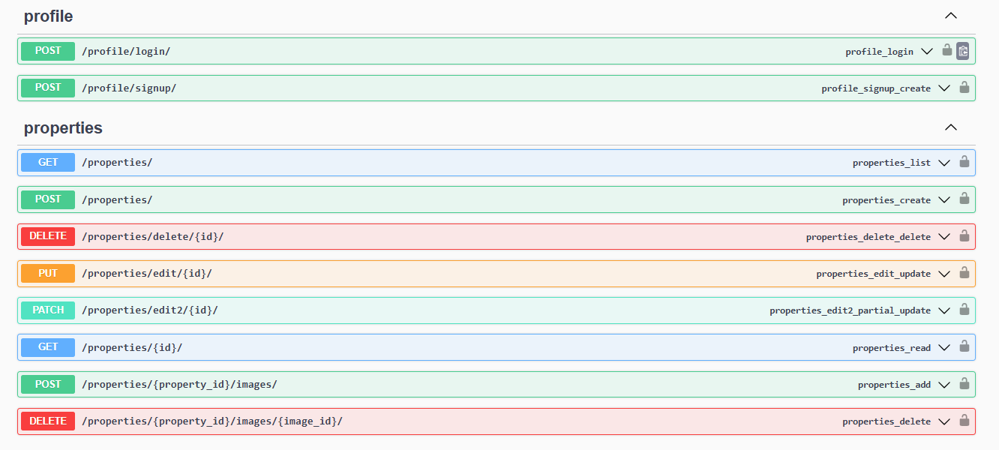

# Property Rental Management System
### Description: Build a Django backend for a property rental platform where landlords can list their properties, tenants can browse listings and book properties, and both parties can manage their rental agreements, payments, and reviews.

## ---------------------------------------------------------
# Setup
#### Create a new directory
#### Change to this directory
#### Clone  this Repo to the current directory
- `git clone https://github.com/M7mmed-Sayed/Property-Rental-Management-System.git`

#### Set up a virtual environment and activate it at Windows open ``` terminal ``` and write the following commands:
1. `python -m pip install virtualenv`
2. `python -m virtualenv venv`
3. `venv\scripts\activate`
4. `pip3 install -r requirements.txt`  to install required packages 
5. `py manage.py runserver 8000`  Run the server  

## ---------------------------------------------------------
# APIs

